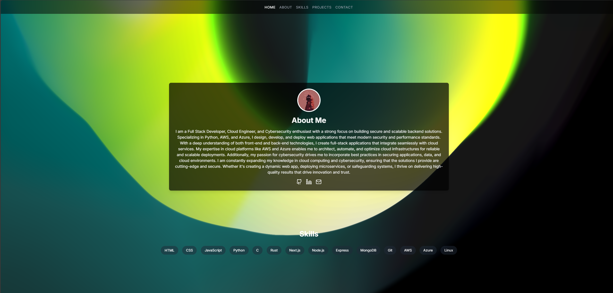

# Portfolio Website

This is a personal portfolio website showcasing my projects, skills, and contact information. The website is built using Next.js and deployed on Vercel.


## Website

The website is live at [Vercel](https://portfoliowebsite-gamma-blush.vercel.app/)


*Home Page*


*About Page*


*Projects Page*

## Features

- **Home Page**: Introduction and overview.
- **About**: Information about me, my background, and my skills.
- **Projects**: A showcase of my projects with descriptions and links.
- **Contact**: A contact form to get in touch with me.

## Technologies Used

- **Next.js**: React framework for server-side rendering and static site generation.
- **Tailwind CSS**: Utility-first CSS framework for styling.
- **Framer Motion**: Library for animations.
- **Vercel**: Platform for deployment.

## Getting Started

To run this project locally, follow these steps:

1. **Clone the repository**:
    ```sh
    git clone https://github.com/cyrixninja/Portfolio
    cd Portfolio
    ```

2. **Install dependencies**:
    ```sh
    npm install
    # or
    yarn install
    ```

3. **Run the development server**:
    ```sh
    npm run dev
    # or
    yarn dev
    ```

4. **Open your browser** and visit [http://localhost:3000](http://localhost:3000) to see the result.

## Deployment

The website is deployed on Vercel. To deploy your own version, follow these steps:

1. **Push your code to GitHub**.
2. **Create a new project on Vercel** and link it to your GitHub repository.
3. **Configure your project settings** and deploy.

## License

This project is licensed under the Apache License 2.0. See the [LICENSE](LICENSE) file for more details.

## Contact

Feel free to reach out to me via the contact form on the website or through my [LinkedIn](https://linkedin.com/in/cyrixninja) profile.

---

Thank you for visiting my portfolio website!